# Event Registration & Check-In Flow

## Complete Process Flowchart

```mermaid
flowchart TD
    Start([User Browses Events]) --> ViewEvent[View Event Details Page]
    ViewEvent --> CheckAuth{User Authenticated?}
    
    CheckAuth -->|No| RedirectSignIn[Redirect to Sign In]
    RedirectSignIn --> SignIn[User Signs In]
    SignIn --> ViewEvent
    
    CheckAuth -->|Yes| CheckRegistered{Already Registered?}
    
    CheckRegistered -->|Yes| ShowRegistered[Show 'Already Registered' Status]
    ShowRegistered --> ViewProfile[Go to Profile Page]
    
    CheckRegistered -->|No| ClickRegister[Click 'Register' Button]
    ClickRegister --> CallRegisterAction[Call registerForEvent Action]
    
    CallRegisterAction --> AddAttendee[Add User to Event Attendees Array]
    AddAttendee --> CreateReg[Call createRegistration]
    
    CreateReg --> GenerateToken[Generate Random Token<br/>crypto.randomBytes 32]
    GenerateToken --> CreateURL[Create Check-In URL<br/>/check-in/token]
    CreateURL --> InsertDB[(Insert into event_registrations<br/>with token, user_id, event_id)]
    
    InsertDB --> ReturnSuccess{Success?}
    ReturnSuccess -->|No| ShowError[Show Error Message]
    ReturnSuccess -->|Yes| ShowSuccess[Show Success Message]
    
    ShowSuccess --> ViewProfile
    ViewProfile --> FetchRegs[Fetch getMyRegistrations]
    FetchRegs --> DisplayQR[Display QR Code Cards<br/>with Event Details]
    
    DisplayQR --> UserAction{User Action}
    UserAction -->|Download QR| DownloadQR[Download QR Code Image]
    UserAction -->|View Details| ShowDetails[Show Event Info & Status]
    UserAction -->|Wait for Event| EventDay
    
    DownloadQR --> EventDay[Event Day Arrives]
    EventDay --> UserPresent[User Arrives with QR Code]
    
    UserPresent --> OrganizerScan[Organizer Scans QR Code<br/>or Opens Check-In Link]
    OrganizerScan --> LoadCheckIn[Load /check-in/token Page]
    
    LoadCheckIn --> FetchRegByToken[getRegistrationByToken<br/>Admin Client Query]
    FetchRegByToken --> RegExists{Registration Found?}
    
    RegExists -->|No| Show404[Show 404 - Invalid Token]
    RegExists -->|Yes| FetchCurrentUser[Get Current User Info]
    
    FetchCurrentUser --> CheckPermission{Has Permission?<br/>Event Owner OR<br/>Club Admin/Manager}
    
    CheckPermission -->|No| ShowWarning[Show Warning Card<br/>Unauthorized to Check In<br/>Disabled Button]
    CheckPermission -->|Yes| ShowCheckInUI[Show Check-In UI<br/>Event Details + Button]
    
    ShowWarning --> CannotCheckIn([End - Cannot Check In])
    
    ShowCheckInUI --> AlreadyChecked{Already Checked In?}
    AlreadyChecked -->|Yes| ShowCheckedStatus[Show 'Already Checked In'<br/>Badge with Timestamp]
    AlreadyChecked -->|No| EnableButton[Enable 'Mark as Checked In' Button]
    
    ShowCheckedStatus --> Complete([End - Already Complete])
    
    EnableButton --> ClickCheckIn[Organizer Clicks Button]
    ClickCheckIn --> CallMarkCheckedIn[Call markCheckedIn Action]
    
    CallMarkCheckedIn --> VerifyPermission{Verify Permission Again<br/>Event Owner OR<br/>Club Admin/Manager}
    
    VerifyPermission -->|No| PermissionError[Return Error<br/>Unauthorized]
    PermissionError --> ShowErrorMsg[Show Error Message]
    ShowErrorMsg --> CannotCheckIn
    
    VerifyPermission -->|Yes| UpdateDB[(Update event_registrations<br/>SET checked_in = true<br/>SET checked_in_at = NOW)]
    
    UpdateDB --> UpdateSuccess{Update Success?}
    UpdateSuccess -->|No| DBError[Show Database Error]
    DBError --> ShowErrorMsg
    
    UpdateSuccess -->|Yes| RefreshPage[Refresh Page/State]
    RefreshPage --> ShowSuccess2[Show Success Badge<br/>Checked In at Timestamp]
    ShowSuccess2 --> Complete
    
    style Start fill:#e1f5e1
    style Complete fill:#e1f5e1
    style CannotCheckIn fill:#ffe1e1
    style Show404 fill:#ffe1e1
    style ShowError fill:#ffe1e1
    style ShowWarning fill:#fff4e1
    style GenerateToken fill:#e1f0ff
    style InsertDB fill:#f0e1ff
    style UpdateDB fill:#f0e1ff
```



## Key Components & Functions

### 1. **Registration Phase**
- **Action**: `registerForEvent()` in `lib/actions/events.ts`
- **Creates**: Registration record with unique token
- **Database**: `event_registrations` table
- **Token**: 32-byte random hex string via `crypto.randomBytes(32)`

### 2. **QR Code Generation**
- **Utility**: `generateQRCode()` in `lib/utils/qrcode.ts`
- **URL**: `/check-in/[token]`
- **Display**: Profile page with download option

### 3. **Check-In Verification**
- **Page**: `/app/check-in/[token]/page.tsx`
- **Component**: `check-in-content.tsx`
- **Permissions**: Event owner OR club admin/manager roles

### 4. **Database Schema**
```sql
event_registrations
├── id (uuid, primary key)
├── event_id (uuid, foreign key)
├── user_id (uuid, foreign key)
├── registration_token (text, unique)
├── checked_in (boolean, default false)
├── checked_in_at (timestamp)
├── created_at (timestamp)
└── updated_at (timestamp)
```

### 5. **Permission Check Logic**
```typescript
// Check if current user can check in attendees
const isEventOwner = event.created_by === currentUser.id;
const isClubAdminOrManager = 
  event.club?.members?.some(m => 
    m.user_id === currentUser.id && 
    (m.role === 'admin' || m.role === 'manager')
  );
const hasPermission = isEventOwner || isClubAdminOrManager;
```

## Security Features

✅ **Token Security**: 32-byte cryptographically random tokens  
✅ **Admin Queries**: Check-in lookup uses admin client to access any registration  
✅ **RLS Policies**: Row Level Security enforces data access rules  
✅ **Permission Checks**: Double verification (UI + server action)  
✅ **Unique Tokens**: Database constraint prevents duplicates  

## User Experience Flow

1. **Browse** → View event details
2. **Register** → Click register button
3. **Receive** → Get QR code ticket in profile
4. **Download** → Save QR code to device
5. **Attend** → Show QR at event entrance
6. **Scan** → Organizer opens check-in link
7. **Verify** → System checks permissions
8. **Check-In** → Mark attendee as present
9. **Confirm** → See success badge with timestamp

## Error Handling

- Invalid token → 404 page
- Unauthorized user → Warning card with disabled button
- Already checked in → Badge showing timestamp
- Database errors → User-friendly error messages
- Missing permissions → Clear access denial message
